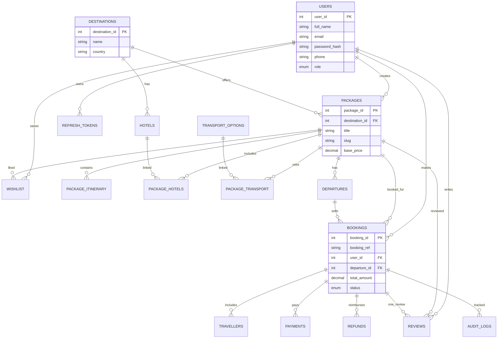

# Bonvoyagency ER Diagram

```mermaid
erDiagram
  USERS ||--o{ BOOKINGS : makes
  USERS ||--o{ PACKAGES : creates
  USERS ||--o{ REVIEWS : writes
  USERS ||--o{ WISHLIST : saves
  USERS ||--o{ REFRESH_TOKENS : owns

  DESTINATIONS ||--o{ HOTELS : has
  DESTINATIONS ||--o{ PACKAGES : offers

  PACKAGES ||--o{ PACKAGE_ITINERARY : contains
  PACKAGES ||--o{ PACKAGE_HOTELS : includes
  PACKAGES ||--o{ PACKAGE_TRANSPORT : uses
  PACKAGES ||--o{ DEPARTURES : has
  PACKAGES ||--o{ BOOKINGS : booked_for
  PACKAGES ||--o{ REVIEWS : reviewed
  PACKAGES ||--o{ WISHLIST : liked

  HOTELS ||--o{ PACKAGE_HOTELS : linked
  TRANSPORT_OPTIONS ||--o{ PACKAGE_TRANSPORT : linked
  DEPARTURES ||--o{ BOOKINGS : sells
  BOOKINGS ||--o{ TRAVELLERS : includes
  BOOKINGS ||--o{ PAYMENTS : pays
  BOOKINGS ||--o{ REFUNDS : reimburses
  BOOKINGS ||--o{ REVIEWS : one_review
  BOOKINGS ||--o{ AUDIT_LOGS : tracked

  USERS {
    int user_id PK
    string full_name
    string email
    string password_hash
    string phone
    enum role
  }

  DESTINATIONS {
    int destination_id PK
    string name
    string country
  }

  PACKAGES {
    int package_id PK
    int destination_id FK
    string title
    string slug
    decimal base_price
  }

  BOOKINGS {
    int booking_id PK
    string booking_ref
    int user_id FK
    int departure_id FK
    decimal total_amount
    enum status
  }
```
